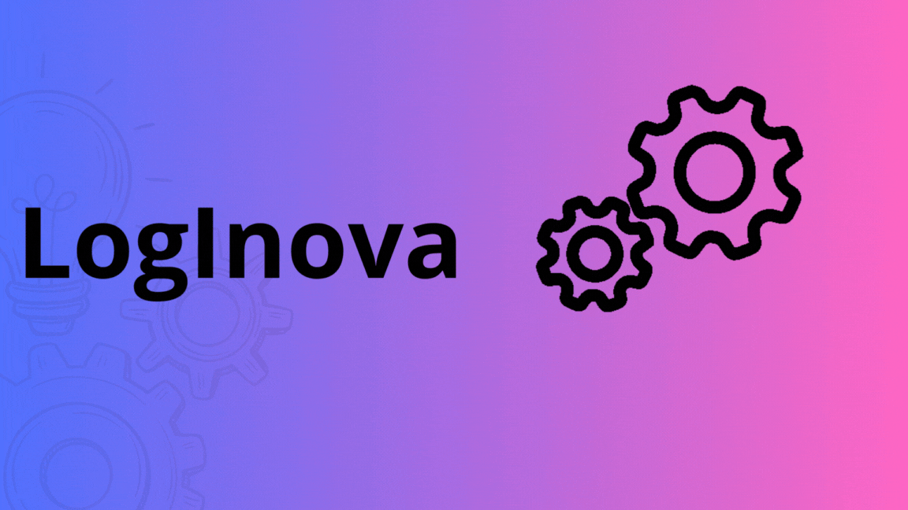

  <h1 align="center"> :construction: Projeto em construção :construction: </h1>
  
  # Índice 

* [História da Empresa](#História-da-Empresa-)
* [Contexto e Objetivos do Projeto](#Contexto-e-Objetivos-do-Projeto-)
* [Funcionalidades do Projeto](#Funcionalidades-do-Projeto-)
* [Metodologia Utilizada](#Metodologia-Utilizada-)
* [Plano de Entrega](#Plano-de-Entrega)
* [Glossário](#Glossário)
* [Resultado das Análises](#Resultado-das-Análises)
* [Recomendações](#Recomendações)
* [Próximos Passos](#Próximos-Passos)
* [Autores](#Autores)
* [Conclusão](#Conclusão)

# História da Empresa 📚
  A LogInova é uma empresa de consultoria em logística fundada em 2022 por um grupo de profissionais com experiência no setor. A empresa foi criada com o objetivo de ajudar organizações a otimizar suas operações logísticas, reduzir custos e melhorar a eficiência.
A empresa trabalha em estreita colaboração com seus clientes para entender suas necessidades específicas e desenvolver soluções sob medida que atendam a essas necessidades. Além disso, a empresa está sempre atualizada com as tendências e tecnologias mais recentes no setor logístico, permitindo que seus clientes se mantenham competitivos.
A LogInova também é reconhecida por seus consultores altamente qualificados, que possuem ampla experiência em diferentes áreas da logística, incluindo gestão de estoques, gestão de transporte, planejamento de rotas, armazenagem e distribuição.

<a href="#top">voltar ao topo</a>

# Contexto e Objetivos do Projeto 🎯
  O objetivo do projeto da LogInova é ajudar a organização do cliente a melhorar suas operações logísticas, reduzir custos e aumentar a eficiência. O projeto pode incluir análises detalhadas dos processos logísticos da organização, identificação de gargalos, sugestões de melhorias, implementação de tecnologias e métodos mais eficientes, e recomendações de melhores práticas do setor.

<a href="#top">voltar ao topo</a>

#  Funcionalidades do projeto 🔨

 - `Funcionalidade 1`: Análise de custos de todos os processos para identificar minimizações
 
 - `Funcionalidade 2`: Análise de processos logísticos existentes para identificar oportunidades de melhoria
    
 - `Funcionalidade 2a`: Desenvolvimento de soluções personalizadas para atender às necessidades específicas do cliente
    
 - `Funcionalidade 3`: Identificação de gargalos e recomendações de ações para solucioná-los
 

 
 
<a href="#top">voltar ao topo</a>

  
# Metodologia Utilizada 👨‍💻
  A LogInova utiliza uma variedade de tecnologias para ajudar seus clientes a melhorar a eficiência de suas operações logísticas. Algumas das tecnologias mais comuns     usadas pela empresa incluem:
  - Jira Software
  - GitHub
  - Google Colab

<a href="#top">voltar ao topo</a>

# Plano de Entrega
**Sprint 1**
- [x] Login Jira e Github
- [x] Análise de dados através de programação python
- [x] Apontamento das inconsistências
- [x] Modelo Dashboard
- [x] Documentação (Ata e Glossário)
- [x] Introdução ao Github

<a href="#top">voltar ao topo</a>

# Glossário
Um glossário é um determinado domínio de conhecimento com a definição de termos de difícil compreensão.  
Nesse caso são os título de cada célula do excel, para isso geramos um 
link de fácil acesso para entendermos esses termos.
Caso tenha interesse acesse o link abaixo: 

- <a href='https://github.com/Brudeoli17/Projeto-Marcus/blob/main/Documentos/GLOSS%C3%81RIO.pdf'><button>Glossário</button></a>

<a href="#top">voltar ao topo</a>

 

# Resultado das Análises

<a href="#top">voltar ao topo</a>

# Recomendações

<a href="#top">voltar ao topo</a>

# Próximos Passos

<a href="#top">voltar ao topo</a>

# Autores
LinkedIn| Foto| Nome

https://www.linkedin.com/in/gabriela-let%C3%ADcia-6435151a2

<a href="#top">voltar ao topo</a>

# Conclusão

<a href="#top">voltar ao topo</a>

